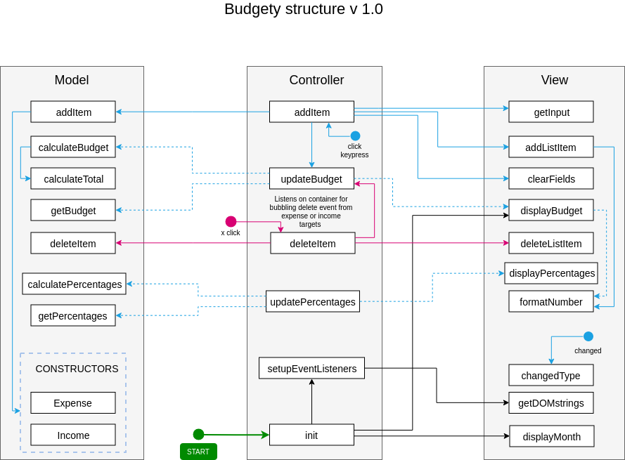

# Budgety

Simple budget tracker. No persistent storage, don't try to setup your real finances 😂

## 🎓 What I Learned?

- DOM manipulations
- Factory OOP patterns
- Separation of concerns
- Planning app structure in draw.io
- Forms and input validation
- Work with money floats

<!--  -->

## 🔗 Links

[The Complete JavaScript Course 2019: Build Real Projects!](https://www.udemy.com/the-complete-javascript-course/)
by Jonas Schmedtmann
